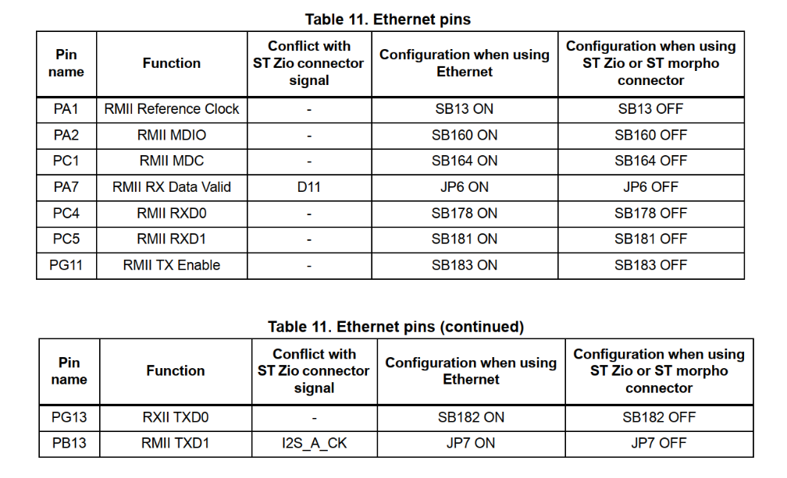
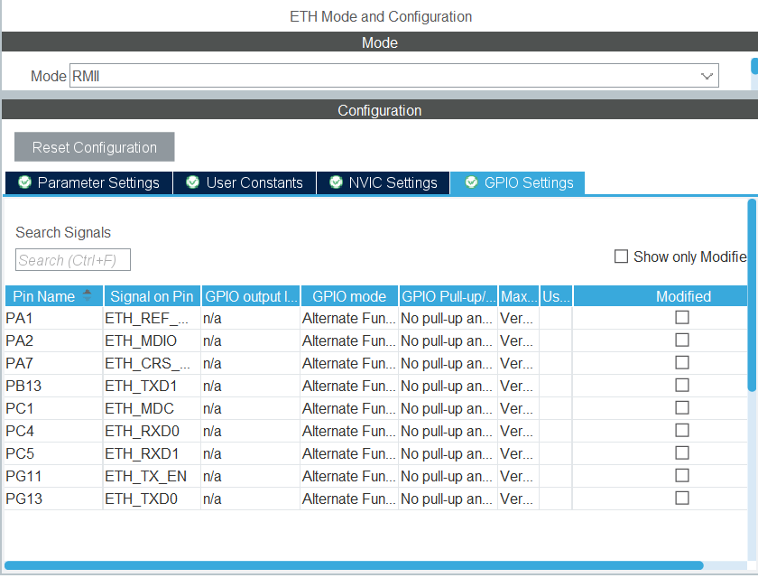

## About The Project

Implementation of http protocol in STM32F429 based on LWIP

https://www.youtube.com/watch?v=8P3_R6Xmhb0

Based on the datasheet, the pins of ethernet are specified as follows

  

 

Therefore, it is required to modify the CubeMX ETH module.

  

 
